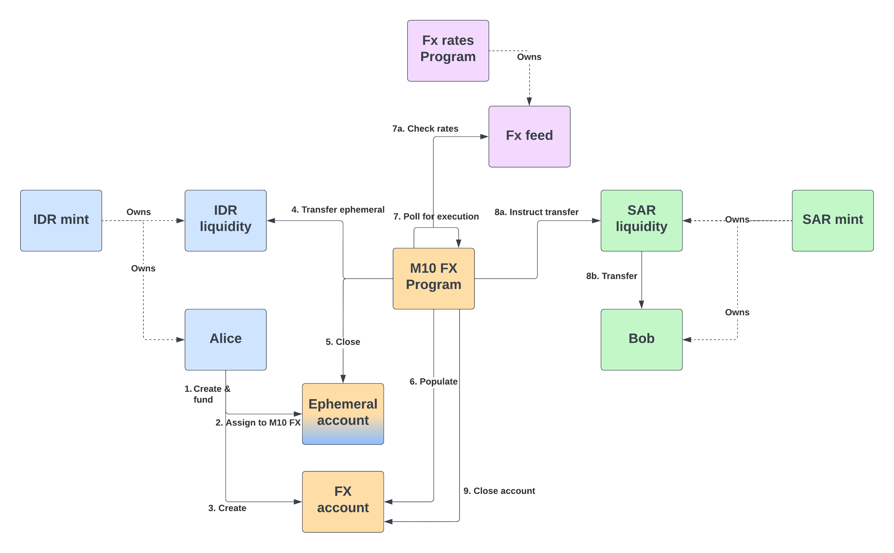

# M10 FX remittance for Solana

This project provides a sample [Solana](https://solana.com/) implementation of a delayed FX remittance smart contract.
It allows the exchange of tokens of currency `A` to be swapped for tokens of currency `B` when certain conditions are met,
i.e. the exchange rate reaches an upper or lower limit, or the validity period for the swap has been reached. This allows users
to optimize for a more opportune FX rate instead of settling for the current market rate.

The program provides a `Solana` smart contract implementation, i.e. a `program`, & a `CLI` tool to interact with the FX program.
Liquidity is provided as a static exchange rate for demo purposes, but can be provided by an external exchange rate oracle, e.g. [ChainLink](https://docs.chain.link/solana/).



## Pre-requisites

* Install the required platform dependencies:
  * `sudo apt-get install libssl-dev libudev-dev pkg-config zlib1g-dev llvm clang cmake make libprotobuf-dev protobuf-compiler`
* Install the [Solana CLI tools](https://docs.solana.com/cli/install-solana-cli-tools)
  * e.g. `sh -c "$(curl -sSfL https://release.solana.com/v1.10.31/install)"`
* Install the [Rust toolchain](https://www.rust-lang.org/tools/install)
  * e.g. `curl --proto '=https' --tlsv1.2 -sSf https://sh.rustup.rs | sh`
* Install the [SPL token CLI](https://spl.solana.com/token)
  * e.g. `cargo install spl-token-cli`
* Note: optionally a Dockerfile is provided for a ready to build and use development environment (give it plenty of resources!)
  * `docker build . --tag m10-fx-solana:latest -f ./Dockerfile`
  * `docker run --name test-ledger --network host --rm -it -v "$(pwd)":/m10-fx-solana m10-fx-solana` (for running the test ledger)
  * `docker run --name m10-fx-solana-cli --network host --rm -it -v "$(pwd)":/m10-fx-solana m10-fx-solana` (for using the CLI)

## Build & Deploy

### CLI

use the `cargo` tool to build the `CLI`:

```shell
cargo build --release --bin m10-fx-solana-cli
```
or run it directly using `cargo run`, e.g.

```shell
cargo run --release --bin m10-fx-solana-cli
```

### Program

Set the cluster to a config of your choice, e.g. for local development:
```shell
solana config set -ul
```

Launch a local Solana test cluster in the directory of your choice using:
In a seperate window, launch a local Solana test cluster in the directory of your choice using:
```shell
solana-test-validator
```

Create a new keypair (~account) and fund it:
```shell
solana-keygen new -o ~/.config/solana/id.json
solana airdrop 10
```

Using the `cargo` tool, run
```shell
cargo build-bpf
```

which provides the instructions for deployment after compiling successfully, e.g.
```shell
solana program deploy ./target/deploy/m10_fx_solana.so
```

## Initialization

We'll need to set up a few identities before we interact with the program. We'll need to set up two tokens: `SAR` &  `IDR`,
representing the `Saudi Riyal` & the `Indonesian Rupiah` respectively. For that we'll need to create 2 Mint accounts in the [spl-token](https://spl.solana.com/token) program.
For each, we'll need to create a liquidity provider account & provide them with a sufficient supply of tokens.
The code in the program is set up to use the keys in the `keys` directory.

```shell
# Generate IDR mint
solana-keygen new --outfile ./keys/idr_mint.key --no-bip39-passphrase
IDR_MINT=$(solana address -k ./keys/idr_mint.key)
spl-token create-token --decimals 2 ./keys/idr_mint.key --mint-authority ./keys/idr_mint.key
solana airdrop 10 $IDR_MINT

# Generate IDR liquidity holding
solana-keygen new --outfile ./keys/idr_liquidity.key --no-bip39-passphrase
IDR_LIQUIDITY=$(solana address -k ./keys/idr_liquidity.key)
spl-token -v create-account --owner ./keys/idr_liquidity.key $IDR_MINT -- ./keys/idr_liquidity.key
spl-token mint --mint-authority ./keys/idr_mint.key $IDR_MINT 1000000 $IDR_LIQUIDITY
solana airdrop 10 $IDR_LIQUIDITY

# Generate SAR mint
solana-keygen new --outfile ./keys/sar_mint.key --no-bip39-passphrase
spl-token create-token --decimals 2 ./keys/sar_mint.key --mint-authority ./keys/sar_mint.key
SAR_MINT=$(solana address -k ./keys/sar_mint.key)
solana airdrop 10 $SAR_MINT

# Generate SAR liquidity holding
solana-keygen new --outfile ./keys/sar_liquidity.key --no-bip39-passphrase
SAR_LIQUIDITY=$(solana address -k ./keys/sar_liquidity.key)
spl-token -v create-account --owner ./keys/sar_liquidity.key $SAR_MINT -- ./keys/sar_liquidity.key
spl-token mint --mint-authority ./keys/sar_mint.key $SAR_MINT 10000000 $SAR_LIQUIDITY
solana airdrop 10 $SAR_LIQUIDITY
```

After that we'll create our two customers, `Alice` & `Bob`, who will be attempting to exchange between `IDR` & `SAR` respectively.

```shell
# Create an IDR account for Alice
solana-keygen new --outfile ./keys/alice.key --no-bip39-passphrase
ALICE=$(solana address -k ./keys/alice.key)
spl-token -v create-account --owner ./keys/alice.key $IDR_MINT -- ./keys/alice.key
spl-token mint --mint-authority ./keys/idr_mint.key $IDR_MINT 5000000 $ALICE
solana airdrop 1 $ALICE

# Create a SAR account for Bob
solana-keygen new --outfile ./keys/bob.key --no-bip39-passphrase
BOB=$(solana address -k ./keys/bob.key)
spl-token -v create-account --owner ./keys/bob.key $SAR_MINT -- ./keys/bob.key
solana airdrop 1 $BOB
```

In case you haven't done so already, now would be a great time to deploy the program:

```shell
# Deploy solana program
cargo build-bpf
solana program deploy ./target/deploy/m10_fx_solana.so

# FX program address
FX_ADDRESS='DN2H8TDdUd5b1FonoP2UsTNgKVuHi1xwMD5Qr9UivH59'
```

## Executing FX swaps

Using the `CLI` a user can interact with the fx program. In order for `Alice` to `Initiate` the contract, she'll need to
invoke the following command:

```shell
cargo run --bin m10-fx-solana-cli -- initiate \
  --signer ./keys/alice.key \
  --amount 100000 \
  --from $ALICE \
  --to $BOB \
  --margin 0.10 \
  --payer ~/.config/solana/id.json \
  --valid-for 30
```

This proposes an FX swap of `1000.00 SAR` from `Alice`'s account to the equivalent in `IDR` for `Bob`. The swap will take place when
either the validity period, defined by `valid-for`, has been exceeded. In this case, the swap will run for a maximum of 60 seconds.
Or if the FX rate moves more than 10% from the current rate, i.e. decreases by or increases by 10%. The `payer` argument defines which account 
will pay the required `sol` fees for the transactions. The `signer` argument indicates `Alice` invokes the contract.

```shell
cargo run --bin m10-fx-solana-cli -- initiate --signer ./keys/alice.key -a 100000 -f $ALICE -t $BOB --margin 0.10 --payer ~/.config/solana/id.json --valid-for 30
     Running `target/debug/m10-fx-solana-cli initiate --signer ./keys/alice.key -a 100000 -f C7UhfEFxFDUYYai4aEvvUm2Ubx6hqVzX2J6P1jPQjL6Z -t AYPFrwvbJ1RQHnn1xMyHYDqJLghmppEcYFwAo6V6oCig --margin 0.10 --payer ~/.config/solana/id.json --valid-for 30`
Initiate { signer: "./keys/alice.key", payer: "~/.config/solana/id.json", from: C7UhfEFxFDUYYai4aEvvUm2Ubx6hqVzX2J6P1jPQjL6Z, to: AYPFrwvbJ1RQHnn1xMyHYDqJLghmppEcYFwAo6V6oCig, amount: 100000, margin: 0.10, valid_for: Some(30) }
Current exchange rate 0.0002509788173878124686276478
Set margin to 0.10. Limits: [0.0002258809356490312217648830, 0.0002760766991265937154904126]
Created account 5VroT7EPENrznkptphxfH2K3T5tLqH7nDsHNBKTbSzKp with 1000 funds
Created FX account 6QCSzK56UKzDxruzgU81XzPEf4PpVMTTrp7bsfCRBPhp
```

The `initiate` command has created an `FX account` (`6QCSzK56UKzDxruzgU81XzPEf4PpVMTTrp7bsfCRBPhp`) which will allow executing the contract it contains.
The contract can be pinged by using the `execute` command using the `SAR liquidity provider` key.

```shell
cargo run --bin m10-fx-solana-cli -- execute \
  --fx-account 6QCSzK56UKzDxruzgU81XzPEf4PpVMTTrp7bsfCRBPhp \
  --liquidity ./keys/sar_liquidity.key \
  --payer ~/.config/solana/id.json
```

This tries to `execute` the fx program with data stored in the `fx-account`. The address of the account is printed at the end of the `initiate` command above.
It needs permission to provide liquidity for the `SAR` token using the `liquidity` argument. Again, the `payer` argument defines which account
will pay the required `sol` fees for the transactions.

```shell
cargo run --bin m10-fx-solana-cli -- execute --fx-account 6QCSzK56UKzDxruzgU81XzPEf4PpVMTTrp7bsfCRBPhp --liquidity ./keys/sar_liquidity.key --payer ~/.config/solana/id.json
  Running `target/debug/m10-fx-solana-cli execute --fx-account 6QCSzK56UKzDxruzgU81XzPEf4PpVMTTrp7bsfCRBPhp --liquidity ./keys/sar_liquidity.key --payer ~/.config/solana/id.json`
Execute { fx_account: 6QCSzK56UKzDxruzgU81XzPEf4PpVMTTrp7bsfCRBPhp, liquidity: "./keys/sar_liquidity.key", payer: "~/.config/solana/id.json" }
Successfully executed FX swap
```

In case of a longer duration contract, the `execute` command will continue polling every 15 seconds until the program has completed.

## References

* [Solana](https://solana.com/)
* [Programming on Solana - An Introduction](https://paulx.dev/blog/2021/01/14/programming-on-solana-an-introduction/)
* [ChainLink](https://docs.chain.link/solana/)
